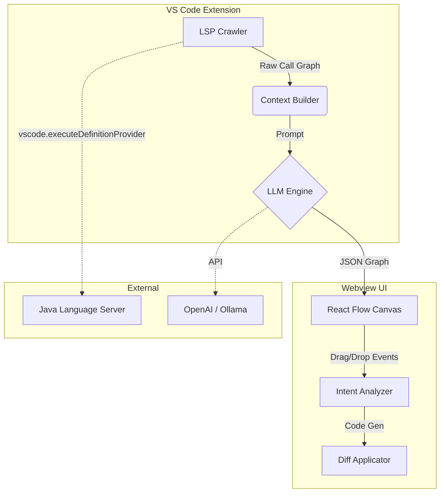

# CodeFlow AI 🌊

> **Logic First, Syntax Second.**
> **逻辑优先，语法次之。**
>
> 专为**遗留代码 (Legacy Code)** 打造的智能可视化、理解与重构助手。
> The intelligent assistant for visualizing, understanding, and refactoring brownfield projects.

---

## 📖 背景与痛点 (The Problem)

在企业级软件开发中，我们 80% 的时间花在阅读和维护旧代码上。开发者面临着巨大的认知负荷：
- **迷宫般的调用链**：业务逻辑散落在 Controller、Service、Manager 和 DAO 等几十个文件中。
- **Source Insight 的缺失**：现代 IDE 缺乏像 Source Insight 那样强大的**实时调用关系 (Call Graph)** 可视化能力。
- **修改的恐惧**：面对 500 行的“面条代码”，不敢轻易修改，生怕引发未知的副作用 (Side Effects)。

## 🚀 解决方案 (The Solution)

**CodeFlow AI** 是一个 VS Code 插件，旨在打造 **"现代版 + AI 版" 的 Source Insight**。

它不仅仅是画图工具，更是一个**双向绑定**的代码编辑器。
1.  **Read Mode**: 利用 LSP (语言服务协议) 爬取静态调用图 (Static Call Graph)，结合 LLM 进行语义降噪，生成清晰的**业务流程图**。
2.  **Write Mode**: 允许开发者直接拖拽流程节点来修改逻辑，AI 负责处理底层的代码实现与重构。

---

## ✨ 核心功能 (Core Features)

### 1. 🕵️‍♂️ 上下文感知的可视化 ("考古模式")
*   **跨文件追踪 (LSP Crawler)**: 自动穿透层级，从入口函数递归抓取完整调用链，解决“只见树木不见森林”的问题。
*   **语义降噪**: LLM 自动过滤 `log.info`、`if (obj != null)` 等技术噪音，只展示“校验用户”、“扣减库存”等核心业务节点。
*   **副作用预警**: 在流程图中高亮标记修改数据库 (DB Write) 或调用外部接口 (RPC) 的节点 ⚠️。

### 2. 🧩 混合编排 ("架构师模式")
支持 **"流程图即代码" (Flow is Code)** 的交互体验。
*   **现有能力复用**: 自动扫描项目中的 `public` 方法（如 `EmailService.send`），将其转化为可拖拽的积木块。
*   **自然语言节点**: 在流程图中输入 **"检查黑名单"**，AI 自动生成符合项目规范的新方法代码，并将其编排进现有流程。
*   **智能重构**: 拖拽交换节点顺序，AI 自动处理变量作用域 (Scope) 和数据流依赖 (Data Flow) 的调整。

### 3. 🛡️ 安全注入
*   **Diff 优先**: 绝不静默修改文件。提供清晰的 Diff 视图，展示 AI 提议的变更。
*   **风格模仿**: AI 会分析当前文件的编码风格（命名规范、异常处理），确保生成的代码与旧代码风格一致。

---

## 🛠️ 技术架构 (Architecture)



*   **LSP Crawler**: 利用 VS Code 原生能力构建静态调用图，无需自行解析复杂语法。
*   **Hybrid Registry**: 维护一份“现有函数”与“AI 虚拟函数”的混合索引表。
*   **React Flow**: 承载前端交互，支持节点拖拽、连线和属性编辑。

---

## ⚡ 快速开始 (Getting Started)

1.  **安装插件**: 在 VS Code 扩展市场搜索 "CodeFlow AI" 并安装。
2.  **打开项目**: 打开任意 Java/TypeScript 遗留项目。
3.  **生成流程图**:
    - 右键点击任意复杂方法名（如 `checkout`）。
    - 选择 **"CodeFlow: Visualize"**。
4.  **编辑逻辑**:
    - 在右侧画布中，拖拽节点调整顺序。
    - 在侧边栏输入 "添加短信通知"，拖入生成的 AI 节点。
5.  **应用变更**: 点击 "Apply Changes"，审查代码 Diff 并保存。

---

## ⚠️ 产品边界 (Boundaries)

为了保持专注，我们明确**不做**以下事情：
*   ❌ **不支持全项目生成**: 我们关注单一业务流 (Function/Flow level)，不支持一键生成整个 App。
*   ❌ **不替代算法编写**: 复杂的数学算法或正则匹配请直接写代码，CodeFlow 专注于**业务流程编排**。

---

## 💻 开发指南 (Development Guide)

### 环境准备 (Prerequisites)

*   Node.js (Recommended: 18.x)
*   npm

### 安装依赖 (Installation)

```bash
npm install
```

### 调试步骤 (Debugging Steps)

1.  **启动调试 (Start Debugging)**:
    *   在 VS Code 中打开本项目。
    *   按下 `F5` 键，或点击左侧调试图标并选择 "Run Extension"。
    *   这将启动一个新的 VS Code 窗口 (Extension Development Host)。

2.  **测试功能 (Test Functionality)**:
    *   在新的 Host 窗口中，打开任意代码文件（例如 TypeScript 或 Java 文件）。
    *   右键点击某个函数名，选择 **"CodeFlow: Visualize"**。
    *   此时应弹出 CodeFlow 面板并显示流程图。

3.  **Webview 调试 (Webview Debugging)**:
    *   如果在 Webview 中遇到问题，可以在 Host 窗口中按下 `Ctrl+Shift+I` (Windows) / `Cmd+Option+I` (Mac) 打开开发者工具 (Developer Tools)。

---

## 📝 License

MIT License © 2024 CodeFlow AI Team